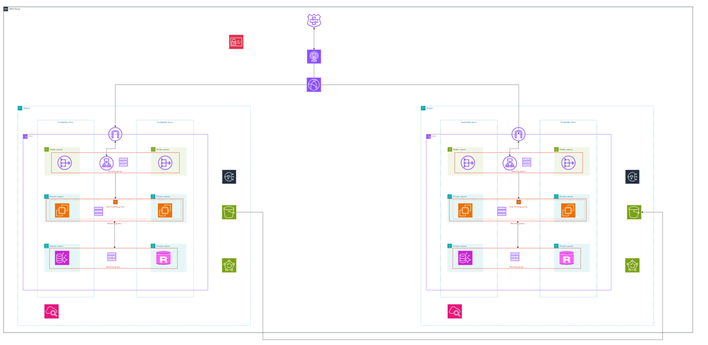

# Disaster Recovery System

## Overview
This project implements a disaster recovery system designed to help organizations maintain business continuity during and after disruptive events.

## Features
- Automated backup and recovery procedures
- Real-time system monitoring
- Failover capabilities
- Data replication across multiple sites
- Incident response management
- Recovery time objective (RTO) and recovery point objective (RPO) tracking

## Prerequisites
- List any required software, hardware, or dependencies
- Minimum system requirements
- Network requirements

## Architecture Diagram

## Note
This is subject to improvement. 